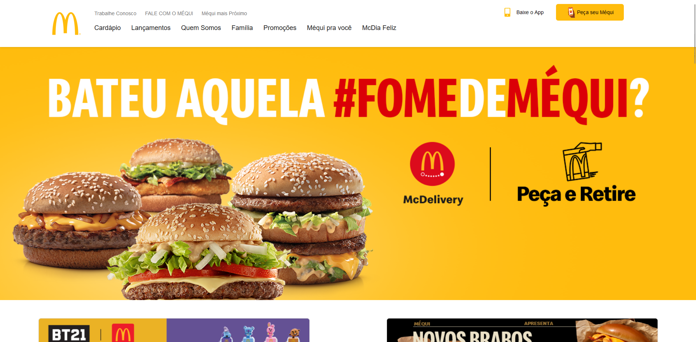

# McDonald's Website Clone: Projeto de Front-End Design



## Descrição

Este projeto é uma tentativa de replicar o site do McDonald's utilizando tecnologias de Front-End, como HTML e CSS. O objetivo foi criar uma interface visualmente semelhante ao site oficial, aproveitando recursos como Grid e Flexbox para estruturação e responsividade.

## Funcionalidades
- **Seções de Produtos**: Reprodução das seções de produtos com imagens e descrições que imitam o estilo da página oficial do McDonald's.
- **Rodapé Personalizado**: Criação de um rodapé semelhante ao do site original, com links para páginas de políticas e redes sociais.

## Observações
- Este projeto é puramente educativo e não tem afiliação oficial com o McDonald's.
- As funcionalidades do site original não foram implementadas.
- Imagens e textos usados são fictícios ou replicados para fins de estudo.

## Tecnologias Utilizadas
- HTML5
- CSS3
- Flexbox
- CSS Grid

## Instruções de Uso

1. Clone este repositório para sua máquina local:
   ```
   git clone https://github.com/seu-usuario/mcdonalds-clone.git
   ```
2. Navegue até o diretório do projeto:
   ```
   cd mcdonalds-clone
   ```
3. Abra o arquivo `index.html` no navegador de sua escolha para visualizar o projeto.

## Colaboradores

<div style="display: flex; justify-content: space-between; align-items: center;">
<a href="https://github.com/jaoAprendiz" target="_blank" style="text-align: center; margin-right: 10px;">

<p style="font-size:min(2vh, 36px); margin-top: 10px;">João Victor Soave - RM 557595</p>
</a>

<a href="https://github.com/seu-K1rit03" target="_blank" style="text-align: center; margin-right: 10px;">

<p style="font-size:min(2vh, 36px); margin-top: 10px;">Thiago - RM XXXXXXX</p>
</a>

<a href="https://github.com/iannyrfs" target="_blank" style="text-align: center; margin-right: 10px;">

<p style="font-size:min(2vh, 36px); margin-top: 10px;">Ianny - RM XXXXXXX</p>
</a>

<a href="https://github.com/JeannMatheuss" target="_blank" style="text-align: center; margin-right: 10px;">

<p style="font-size:min(2vh, 36px); margin-top: 10px;">Jean - RM XXXXXXX</p>
</a>

<a href="https://github.com/Malice112" target="_blank" style="text-align: center; margin-right: 10px;">

<p style="font-size:min(2vh, 36px); margin-top: 10px;">Maria Alice - RM XXXXXXX</p>
</a>
</div>
